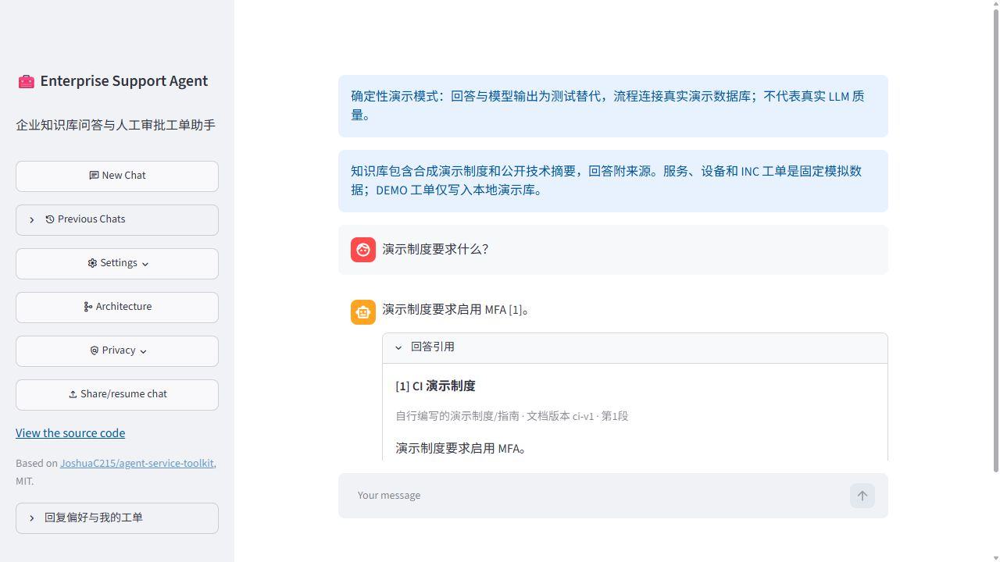
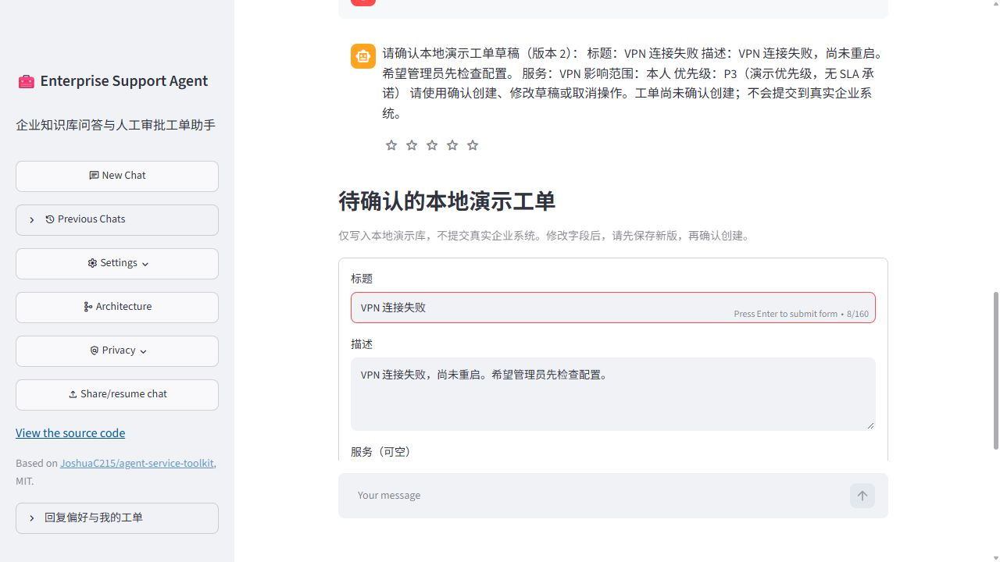
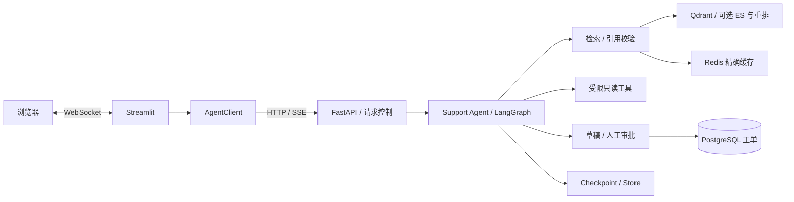

# Enterprise Support Agent

企业知识库与智能工单助手：带引用回答、只读诊断工具和人工审批工单，支持会话恢复与可追溯评测。

[](https://github.com/penpendashuai-alt/enterprise-support-agent/actions/workflows/test.yml)
[](LICENSE)

这是基于 [agent-service-toolkit](https://github.com/JoshuaC215/agent-service-toolkit) 的学习与工程实践 Fork。资料和业务身份为合成演示数据，服务/设备工具为固定模拟；批准后的 DEMO 工单写入真实业务数据库，没有接入真实企业工单系统。

## 核心能力

- **知识问答**：独立检索、来源展示、引用编号校验；无证据时保留边界。
- **受控 Agent**：结构化 Router、信息澄清、按意图限制只读工具及参数校验。
- **人工审批**：生成可编辑草稿，修改后再次确认；版本与内容指纹绑定批准。
- **持久化与恢复**：Checkpoint、用户偏好与工单分层存储，重复批准核查同一请求。
- **工程验证**：精确检索缓存、容量与限流、故障恢复、过滤后的业务追踪和 CI。

## 实际界面与演示





截图来自真实浏览器和实际 PostgreSQL/Redis/Qdrant 容器，聊天及向量使用明确的确定性测试替代，不能代表真实 LLM 回答质量。[五分钟操作脚本与验证范围](docs/demo.md)。

## 架构



[实际图节点与存储职责](docs/architecture.md) · [设计取舍](docs/design_decisions.md)

## 快速开始

前提：Git、Docker Engine/Desktop 与 Compose 2.24.4+；首次构建建议预留至少 20 GB 磁盘。Python 工具使用 3.12～3.14，仓库锁定 uv 0.12.5；容器按 uv.lock 构建。以下命令从仓库根目录执行。

### 确定性演示：不需要个人模型密钥

```sh
git clone https://github.com/penpendashuai-alt/enterprise-support-agent.git
cd enterprise-support-agent
docker compose --env-file docker/ci.env -p esa-p10-demo -f compose.yaml -f compose.local.yaml -f compose.ci.yaml up -d --build --wait
```

访问 <http://127.0.0.1:8501>，Service 为 <http://127.0.0.1:8080>。使用新的项目名隔离日常数据。CI 配置显式启用 fake 模型与本地单块 MFA 知识，迁移和 index 初始化完成后 Service 启动；不存在“缺密钥自动成功”的 fallback。按 [演示脚本](docs/demo.md) 输入固定示例，这个模式不理解任意自然语言。

停止且保留演示数据：

```sh
docker compose --env-file docker/ci.env -p esa-p10-demo -f compose.yaml -f compose.local.yaml -f compose.ci.yaml down
```

### 真实模型运行

复制 [docker/compose.env.example](docker/compose.env.example) 为私有 `.env.compose`，填写聊天、Embedding、已有 Qdrant v2 collection、共享 Bearer 和数据库密码；不提交个人配置。默认采用 Dense20/v2，启动不自动付费向量化。

```sh
docker compose --env-file .env.compose -p esa-demo config --quiet
docker compose --env-file .env.compose -p esa-demo up -d --build --wait
```

访问相同默认端口。缺失/不兼容知识索引会显示检索不可用；核心健康不代表真实模型或索引可调用。首次知识导入需要单独准备、预算与契约核对，详见 [部署](docs/deployment.md)。Hybrid/重排为可选组件，需要配对索引和独立配置，不属于默认启动栈。

## 可验证结果与限制

| 证据 | 结论 |
| --- | --- |
| Phase 5：128 查询、7 组对照 | Dense20 是 dev 默认选择；必要条款覆盖和无答案处理存在取舍，未证明优于旧 Dense5 |
| Phase 7：4 个真实 Agent 样本/组 | 缓存可避免命中时外部检索调用；没有证明端到端提速 |
| Phase 8：heldout 24 任务 | 冻结契约基线/候选均 20/24；草稿补审后 19/24、18/24，未证明整体质量提升 |
| Phase 9：每轮 12 个草稿案例 | 11 个已生成草稿忠实，1 个澄清；不是 12 个任务全部完成 |
| Phase 9 远端 CI | Python 三版本各 375 通过、4 跳过；13 组容器业务与恢复、6 组 Redis 压力检查通过 |

数据与分母来自 [最终 Benchmark](benchmarks/results.md)；Phase 10 新测试/浏览器/CI 状态见 [交付记录](evaluation/phase10/README.md)。375 是历史仓库整体测试快照，包含上游测试，不是模型分数或本人新增数。

当前限定单 worker、客户端声明身份和共享 Bearer；无完整登录、多租户权限、高可用或生产 SLA。数据为自建合成集与公开技术摘要，语义审阅非独立。本地正式知识库付费导入与当前部署的 Hybrid 运行未验证；真实 LLM 新浏览器演示未执行。

## Upstream Project

上游 [JoshuaC215/agent-service-toolkit](https://github.com/JoshuaC215/agent-service-toolkit) 提供 LangGraph Agent 服务骨架、FastAPI、SSE、AgentClient、Streamlit 界面、多模型适配和基础测试/部署示例。本 Fork 保留 MIT 许可证与上游归属；上游示例仍在源码中，默认仅启用 support-agent。

## My Major Changes

- 新增企业支持图、结构化 Router、工具允许集合和知识证据约束；没有把全部 LangGraph/FastAPI 框架归为新开发。
- 新增 Qdrant 企业检索链路、共享索引快照、可选 ES/RRF/重排和七组对照；没有将整个上游 Chroma 系统迁移。
- 新增可编辑工单草稿、人工审批、版本绑定、PostgreSQL 幂等/核查恢复、会话归属和偏好。
- 新增精确 Redis 缓存、有界并发与失败策略、业务追踪过滤及实际容器验收；保留历史失败和负面实验结论。
- 整理离线 Benchmark、真实浏览器流程演示与技术说明。代码开发使用 AI 辅助；个人职责与掌握程度不由测试数量推断。

## 文档与复现

| 内容 | 入口 |
| --- | --- |
| 架构与选择 | [architecture](docs/architecture.md)、[design decisions](docs/design_decisions.md) |
| 检索与任务评测 | [RAG 实验](docs/rag_experiments.md)、[评测说明](docs/evaluation.md)、[Benchmark](benchmarks/results.md) |
| 部署、恢复与演示 | [deployment](docs/deployment.md)、[operations](docs/operations.md)、[demo](docs/demo.md) |
| 验收与阶段历史 | [总索引](evaluation/README.md)、[最终交付](evaluation/phase10/README.md)、[Phase 9](docs/phase9_deployment_observability.md) |

```sh
uv sync --frozen
uv run ruff check
uv run ruff format --check
uv run pyrefly check
uv run pytest
python scripts/summarize_phase10.py --check
```

普通测试隔离付费外部请求；Docker 验收在 CI 的独立 job 运行。离线汇总只需标准库，CSV/Markdown 与来源清单可重建。具体运行模式和专属项目清理见部署文档。

## License

[MIT License](LICENSE)。上游版权与归属保持不变。
