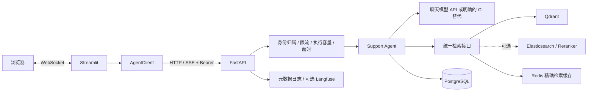
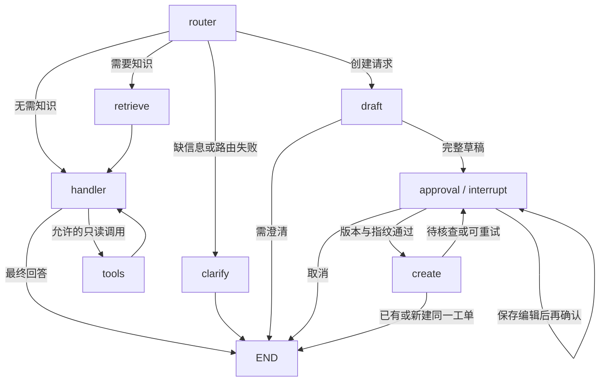

# 系统架构

这是基于 agent-service-toolkit 改造的企业支持演示系统。默认一个 Support Agent worker；业务数据持久化，不连接真实企业工单平台。冻结实验与当前部署的关系见 [评测说明](evaluation.md)。

## 请求与传输

浏览器的连接是 Streamlit WebSocket；Python AgentClient 与 FastAPI 之间才是 HTTP/SSE。审批走结构化 HTTP 请求，不能把用户输入“确认”直接当作批准。入口见 [页面](../src/streamlit_app.py)、[客户端](../src/client/client.py)、[Service](../src/service/service.py) 和 [执行控制](../src/execution/control.py)。

## 实际图

图由 [support_agent.py](../src/agents/support_agent.py) 的 `builder` 定义，审批节点在 [ticket_flow.py](../src/agents/ticket_flow.py)。State 保存 messages、意图、实体、澄清标志、检索结果、草稿 ID/版本、审批状态、批准指纹/请求键和工单结果；每轮路由重置可能过期的业务信息，不靠一段自然语言保存全部控制状态。

Router 输出 Pydantic 结构化决策。检索独立执行，handler 消费统一证据；工具只读且按意图限制允许集合，参数再经 Schema 校验，单步最多 4 次调用，工具执行有超时。草稿生成只抽取事实，人工审批绑定当前版本；这些边界不能保证模型永不误解事实。

## 存储职责

| 存储 | 保存什么 | 不承担什么 |
| --- | --- | --- |
| LangGraph Checkpoint | messages、图状态、中断与恢复 | 不作为工单创建唯一事实来源 |
| PostgreSQL 业务表 | 用户/会话归属、工单、唯一键、草稿内容指纹 | 不替代模型语义判断 |
| LangGraph Store | 显式保存的用户偏好 | 不存全部对话或充当身份系统 |
| Qdrant | 向量块及 manifest，snapshot/模型/维度契约 | 不保存审批状态 |
| ES（可选） | 同一 snapshot 的词法索引 | 不与 Qdrant 形成跨库事务 |
| Redis | 检索缓存、速率状态 | 不作为工单/Checkpoint 权威；无持久化 |

三个 PostgreSQL 角色使用独立连接池，部署启动显式迁移并验证 schema；SQLite 仅为显式开发/测试路径。实现见 [support_storage](../src/support_storage/runtime.py)、[业务仓库](../src/support_storage/postgres.py) 和 [偏好](../src/support_storage/preferences.py)。

## 审批与不确定写入

`draft_id + version` 形成请求键，内容指纹防止同键不同内容；业务唯一约束防止重复批准创建多张。图 Checkpoint 与业务提交不在同一事务，不能宣称端到端 exactly-once。

若数据库已提交但客户端超时或图状态未更新，`create_ticket` 按同一草稿与归属查询。匹配版本及指纹则返回既有工单；查不到才报告已核查失败；查询本身失败则保持 unknown，禁止编辑/取消后另建，重试核查原请求。[创建服务](../src/tickets/service.py)、[审批输入](../src/tickets/models.py)、[恢复测试](../tests/service/test_ticket_approval.py) 可追踪这条路径。

## 检索与运行边界

公开示例与默认 Compose 选择 Dense20/v2、800/100 字符分块、1024 维和 0.65 dense 门槛。代码裸配置仍保留 Phase 4 兼容默认，不能省掉配置后宣称同一方案。Hybrid 使用共享 snapshot、RRF 融合及可选重排，详情见 [检索实验](rag_experiments.md)。

查询改写由 Router 提供，但缓存按规范化后的精确 query 和配置/索引版本隔离，不做语义近似缓存。引用校验检查编号及部分证据契约，不能证明每句话都受证据支持。模拟服务/设备查询来自固定表；DEMO 工单查询来自真实业务库。

单 worker 的会话锁、客户端声明的 user_id 与共享 Bearer 是演示约束，不是多租户权限或生产高可用。Langfuse 默认关闭，开启时只导出白名单元数据，追踪故障不能阻塞业务。部署和故障取舍见 [设计决策](design_decisions.md) 与 [运维](operations.md)。
