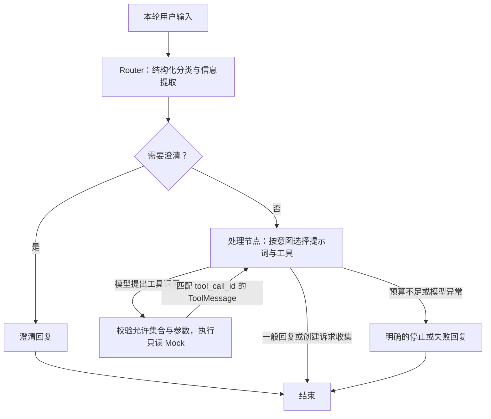

# Phase 2：企业 IT 支持 Agent

> 本文保留 Phase 2 的历史范围与验收结果。当前版本已完成 [Phase 3 工单审批与本地演示创建](phase3_ticket_approval.md)；下文“尚不提交”等描述仅适用于 Phase 2 历史版本。

本阶段在上游 `JoshuaC215/agent-service-toolkit` 上新增企业 IT 支持流程。查询工具全部使用固定模拟数据，没有接入真实企业系统；创建工单仅在对话中收集信息，**尚未提交**。

## 实现与上游边界

本阶段新增：

- `src/agents/support_agent.py`：四类意图、结构化实体、澄清分支、按意图选择工具、受控执行循环。
- `src/agents/support_tools.py`：四个只读 Mock 工具、参数校验与固定样例。
- Agent 注册和默认值、企业支持欢迎语、示例问题及持续显示的模拟数据提示。
- 流程、工具、API/SSE、界面测试，以及真实模型场景脚本和记录。

复用上游：FastAPI `/info`、`/invoke`、`/stream`、SSE 协议、AgentClient、消息协议、LangGraph checkpoint/Store 注入、历史会话、Streamlit 聊天界面、模型配置及测试/CI 框架。本阶段没有重写服务层、客户端或公共接口模型。上游的 `research-assistant`、`chatbot` 等仍可显式选择。

不在本阶段：工单草稿与审批、实际创建工单、真实业务数据库、RAG、Qdrant、Elasticsearch、Redis、OpenTelemetry。固定故障条目的关键词匹配不称为 RAG。

## 调用与状态



`SupportState` 继承 `MessagesState`，业务字段只有 `intent`、`entities`、`needs_clarification`、`clarification_question`，另有框架管理的 `remaining_steps`。消息使用框架合并，不在节点中重复拼接整个历史。

实体包含服务名、设备编号、工单编号、故障描述、`ticket_action=query/create`。Router 每轮返回完整当前实体，结合相关历史理解“GitHub”“那邮箱呢”等续问；不做盲目字典合并。切换到一般知识时清空业务实体，非工单意图清空工单字段。处理节点只接收当前轮消息和本轮实体，避免直接复用之前问题的工具事实。实体提取仍依赖模型判断，不能据此宣称任意输入都能正确切换话题。

`ExtractedEntities` 的字段必须出现，未知值为 `null`；这是 Router 的严格输出契约。`SupportEntities` 提供内部空状态默认值。两者分开，避免模型遗漏字段后被默认空值悄悄接受。

Router 输出不写入 `messages`，模型调用带 `skip_stream`。API 测试使用会真实产生流事件的模拟聊天模型，验证内部标记与分类工具不会进入公开 SSE；同时验证最终 token、工具消息和 `[DONE]`。

## 工具与执行边界

| 意图 | 开放的工具 | 行为 |
| --- | --- | --- |
| `general_question` | 无 | 回答一般 IT 知识；未知企业政策说明缺少依据 |
| `service_status` | `query_service_status` | 缺服务名先澄清，查询后明确模拟性质 |
| `troubleshooting` | 服务状态、设备信息、已知问题查询 | 依据当前输入选择查询并总结排障建议 |
| `ticket_request` / query | `query_existing_ticket` | 缺编号先澄清 |
| `ticket_request` / create | 无 | 用确定性回复收集信息，明确尚未提交、不生成工单编号 |

模型 `bind_tools()` 只控制提供给模型的工具列表。实际执行节点会再次检查允许集合，然后通过工具的 Pydantic schema 校验参数。空值、错误编号格式、额外参数返回受控错误；未允许的工具不执行。每个已保存的工具调用都会收到相同 `tool_call_id` 的结果，即使校验或执行失败。

工具统一返回 `status=success/not_found/error`、`data`、`message`、`is_mock=true`。非法参数在直接调用工具时抛出校验异常，在 Agent 执行边界被转换为 `error` 结果。编号格式是 `INC-四位数字` 与 `DEV-三位数字`，允许大小写和首尾空白。服务名称支持已知别名及“服务”/“ service”后缀。

固定样例：

| 类型 | 数据 |
| --- | --- |
| 服务 | GitHub/VPN 正常；邮箱发送延迟；Jira 中断 |
| 工单 | INC-1001 VPN 问题处理中；INC-1002 邮箱问题已解决 |
| 设备 | DEV-001 Windows 11；DEV-002 macOS 15 |
| 已知问题 | VPN-809、GITHUB-LOGIN、EMAIL-DELAY |

模型节点超时 60 秒，单次模拟工具超时 5 秒，单个模型响应最多执行 4 个工具调用。使用 `RemainingSteps` 预留工具结果与回复步骤；预算不足时不保存新的工具调用，直接结束，避免历史中残留未配对的调用。该机制约束执行循环，不是吞吐量或实时响应 SLA。

## 启动演示

需要 Python 3.12～3.14，并按仓库 README 安装应用依赖。当前开发机使用已有的 `venv`（Python 3.13）。模型配置沿用 `.env.example`，不要提交 `.env`。

在项目根目录的两个 PowerShell 窗口分别执行：

```powershell
.\venv\Scripts\python.exe src/run_service.py
```

```powershell
.\venv\Scripts\python.exe -m streamlit run src/streamlit_app.py
```

若使用 `uv sync --frozen` 创建的环境，将路径中的 `venv` 改为 `.venv`。打开本地 Streamlit 页面，默认 Agent 为 `support-agent`。界面会持续显示模拟数据与“工单尚不提交”的提示。

示例 API 请求：

```powershell
$body = @{message="GitHub 现在有故障吗？"; thread_id="phase2-demo"} | ConvertTo-Json
Invoke-RestMethod -Uri http://localhost:8080/support-agent/invoke -Method Post -ContentType "application/json; charset=utf-8" -Body ([System.Text.Encoding]::UTF8.GetBytes($body))
```

配置了 `AUTH_SECRET` 时需自行附带 Bearer header；同一 `thread_id` 用于续问，换一个编号开始独立会话。`/support-agent/stream` 使用相同输入并返回 SSE。`/invoke`、`/stream` 的默认 Agent 已切换；历史研究助手会话应通过显式的研究助手路径访问。

实测模型标识为 `openai-compatible`：早期运行使用 `deepseek-ai/DeepSeek-V4-Pro-0813`，用户更新供应商配置后的补测使用 DeepSeek 官方接口的 `deepseek-v4-pro`。已实际探测结构化输出、工具调用及工具结果回传后的回复。OpenAI 兼容模型使用 `function_calling`；其他模型使用其适配器默认的结构化输出方式。没有验证所有上游模型。上游 `fake` 模型不具备该 Router 所需的结构化输出，选择它会得到受控失败提示；它仍可用于上游 `chatbot` 演示。

针对 DeepSeek 官方 `api.deepseek.com` 的 `deepseek-v4-pro` / `deepseek-flash`，`get_support_model()` 在 Router 和处理节点使用模型副本，并设置 `thinking.type=disabled`。原因是其 Thinking 模式不接受指定工具的强制选择，而通用 `ChatOpenAI` 也不保留该供应商工具续轮要求的 `reasoning_content`。这一兼容策略只作用于 Support Agent，不修改缓存中的共享模型或其他供应商参数；没有接入新的模型适配依赖。本阶段未实现 Thinking 模式的工具循环。依据：[Thinking 模式文档](https://api-docs.deepseek.com/guides/thinking_mode/)、[Chat Completions 的 tool_choice 约束](https://api-docs.deepseek.com/api/create-chat-completion/)。

## 验证与运行记录

开发日期：2026-09-28。基础提交：`21e2b6a2b78f2cc573514aeb9315a290d75d18fe`。改造尚未提交时，每次真实运行记录同时保存基础提交和相关实现文件的 SHA-256 指纹，用来区分工作区版本。

确定性测试与真实模型验证分开记录。真实场景脚本调用配置的外部模型，会产生 API 用量；通过进程内 FastAPI 的真实路由与临时 SQLite checkpoint 运行，不使用个人的 `checkpoints.db`，不写业务系统。它验证 API/Graph 协作，但不等同于 Docker 部署或浏览器端到端测试。

```powershell
.\venv\Scripts\python.exe -m pytest -q --disable-warnings
.\venv\Scripts\python.exe -m ruff check .
.\venv\Scripts\python.exe -m ruff format --check .
.\venv\Scripts\python.exe -m pyrefly check

$env:PYTHONPATH="src"
.\venv\Scripts\python.exe scripts/run_phase2_scenarios.py --output docs/phase2_runs/new-run.json
```

可用 `--cases P2-03 P2-06` 只运行选定场景。脚本拒绝覆盖旧报告。记录包含模型、日期、代码版本、问题、实体、调用参数、模拟结果、最终回复及自动检查项；不保存凭据。自动检查验证意图、工具选择、关键事实、状态切换和模拟标记，回答是否恰当仍需要逐条复核。

| 场景 | 验收内容 | 验证方式 |
| --- | --- | --- |
| P2-01 | VPN 一般知识，不调用工具 | 真实模型 |
| P2-02 | 未知内部政策不编造 | 真实模型、回复复核 |
| P2-03 | GitHub 模拟正常 | 真实模型、关键事实检查 |
| P2-04 | 邮箱模拟异常 | 真实模型、服务别名回归 |
| P2-05 | 未知服务查无结果 | 真实模型 |
| P2-06 | 缺服务名 → 澄清 → GitHub | 真实模型、多轮测试 |
| P2-07 | VPN 809 固定条目和排障建议 | 真实模型、回复复核 |
| P2-08 | DEV-001 设备信息用于排障 | 真实模型 |
| P2-09 | 不存在的设备不编造配置 | 真实模型 |
| P2-10 | INC-1001 处理中 | 真实模型 |
| P2-11 | 不存在的工单查无结果 | 真实模型 |
| P2-12 | 创建请求先收集信息，尚未提交 | 真实模型、确定性断言 |
| P2-13 | 多意图优先工单，保留 VPN 故障 | 真实模型 |
| P2-14 | GitHub 切换邮箱，更新实体 | 真实模型、多轮测试 |
| P2-15 | 工单切换一般知识，清理工单实体 | 真实模型、多轮测试 |
| P2-16 | 非法分类、缺失实体受控失败 | 注入异常的自动化测试 |
| P2-17 | 参数错误、执行失败、越界调用 | 注入异常的自动化测试 |
| P2-18 | 重复调用在预算内结束，下一轮可继续 | 注入循环的自动化测试 |

### 失败与修正记录

- [第一轮](phase2_runs/2026-09-28-live-01.json)：旧版检查 6/15 通过。可选实体使模型省略服务名、工单动作等字段，导致重复澄清。P2-15 的旧检查只看最后一轮，不能据此算整段对话成功。
- [定向复测](phase2_runs/2026-09-28-live-02.json)：实体字段改为必填且允许 null 后，P2-03、06、13 三项通过。
- [第三轮](phase2_runs/2026-09-28-live-03.json)：旧版自动检查 15/15，但逐条复核发现 P2-04 把“邮箱服务”当作未知服务，P2-07 补充了关闭安全软件的建议。这轮不能记为完整语义验收通过。
- 修正：只对已知服务归一化后缀；明确不建议关闭安全软件；给自动检查补上关键工具事实，避免“调用了正确工具”掩盖返回结果错误。
- [充值后首次续跑](phase2_runs/2026-09-28-live-05.json)：P2-07～15 共 9 项均未通过。接口返回 HTTP 400 `invalid_request_error`，指出旧模型名 `deepseek-ai/DeepSeek-V4-Pro-0813` 不受当前接口支持；普通对话与 Router 探测均复现。用户随后将本地模型名修正为 `deepseek-v4-pro`。此轮是配置失败记录，不计为模型效果通过。
- [模型名修正后续跑](phase2_runs/2026-09-28-live-06.json)：15 项均未通过。普通对话探测成功，但 Router 返回 HTTP 400：`Thinking mode does not support this tool_choice`。据供应商文档，为 Support Agent 的官方 DeepSeek V4 调用显式禁用 Thinking，并保留其他 Agent 的共享配置。新增 HTTP 请求级回归测试覆盖路由、工具调用、工具结果回传及共享模型不被修改；另验证其他供应商配置不受影响。

### 最终验证状态

- 最新全量自动化测试：**240 通过，4 跳过**。相比上次 237 项通过，新增 3 项模型兼容性回归测试。跳过项是原有 Docker 集成测试及依赖外部配置的持久化 smoke tests，不计为通过。
- `ruff check .`、`ruff format --check .`、`pyrefly check` 通过。
- `/info`、两种 Support API、SQLite 多轮、Router 隐藏、工具消息配对通过；Streamlit `AppTest` 验证欢迎语、模拟提示及原有交互，共 16 项通过。
- 原有相关测试基线为 111 通过、1 个 Streamlit 首次配置重跑超时。测试 fixture 固定工具栏配置后，界面测试稳定通过。默认 Agent 切换涉及的会话 fixture 和 Docker 欢迎语断言已更新。
- [此前额度受限运行](phase2_runs/2026-09-28-live-04.json)：P2-01～06 通过，P2-07～15 遇到 HTTP 429 `RateLimitError`，保留原始失败记录。用户充值并修正模型名后，又发现并修复上述 Thinking 模式兼容问题。
- [最终版本完整复测](phase2_runs/2026-09-28-live-07.json)：使用官方 `deepseek-v4-pro`、非 Thinking 模式，**P2-01～15 共 15 个场景全部通过自动检查及逐条回复复核**，包括澄清和话题切换的全部轮次。这次重新执行完整场景集，没有将旧版本结果拼接成最终结论。
- **Phase 2 代码开发与本阶段场景验收完成**。P2-16～18 的异常与循环边界由确定性测试覆盖；Docker/外部数据库、严格序列化模式及长期效果评测仍不在本次已验证范围内。

2026-09-28 最终回复复核摘要：

| 场景 | 复核结果 |
| --- | --- |
| P2-01～02 | 一般知识未调用业务工具；未知企业政策未编造具体时长 |
| P2-03～06 | 正确区分模拟正常、邮箱降级和未知服务；澄清后可查询 GitHub |
| P2-07～08 | 使用 VPN-809 条目及 DEV-001 的 Windows 11 信息；网络策略交由管理员核查，没有建议关闭安全软件 |
| P2-09 | 明确 DEV-999 查无结果，没有编造设备配置 |
| P2-10～11 | INC-1001 进度正确，INC-9999 明确查无结果 |
| P2-12～13 | 仅收集工单信息，明确尚未提交且未生成新编号 |
| P2-14～15 | GitHub 切换邮箱后不复用旧服务结果；切换知识问题后清空工单实体且不调用业务工具 |

需要再次回归时可使用新的报告文件名运行：

```powershell
$env:PYTHONPATH="src"
.\venv\Scripts\python.exe scripts/run_phase2_scenarios.py --output docs/phase2_runs/next-run.json
```

上述少量场景是演示验收样本，不是独立测试集，不能当作泛化准确率或生产任务成功率写入简历。P2-16～18 是明确注入异常的确定性测试，不冒充真实模型自然发生的结果。

## 已知限制与面试要点

- 只支持主要意图，没有复杂任务拆解、真实企业权限、业务写入或 RAG。
- Router 和一般回复仍受模型不确定性影响；企业政策不会由 Mock 数据补全。
- 对话历史尚未做摘要压缩，长会话成本与上下文策略留待后续阶段。
- SQLite 已验证多轮 checkpoint 往返。当前 LangGraph 对自定义 Pydantic 实体发出反序列化注册提示；默认模式可用，尚未验证严格序列化模式和 PostgreSQL 上的新实体。
- 工具超时不会保证强制终止任意同步第三方代码；本阶段工具只有快速、只读的本地查询。
- `/info` 和原有认证/用户 ID 机制来自上游；本阶段不声称实现了企业 SSO 或多租户授权。

面试可结合代码解释：Router 如何区分业务方向与工具选择；为何完整替换实体；为什么 `bind_tools()` 之后仍要校验；`tool_call_id` 配对如何保证下一轮协议有效；为何模型能力探测、固定输出测试、真实场景和回复复核缺一不可。当前新增能力可写为领域路由、状态设计和受控 Mock 工具流程，不能描述成上线的真实工单系统。
