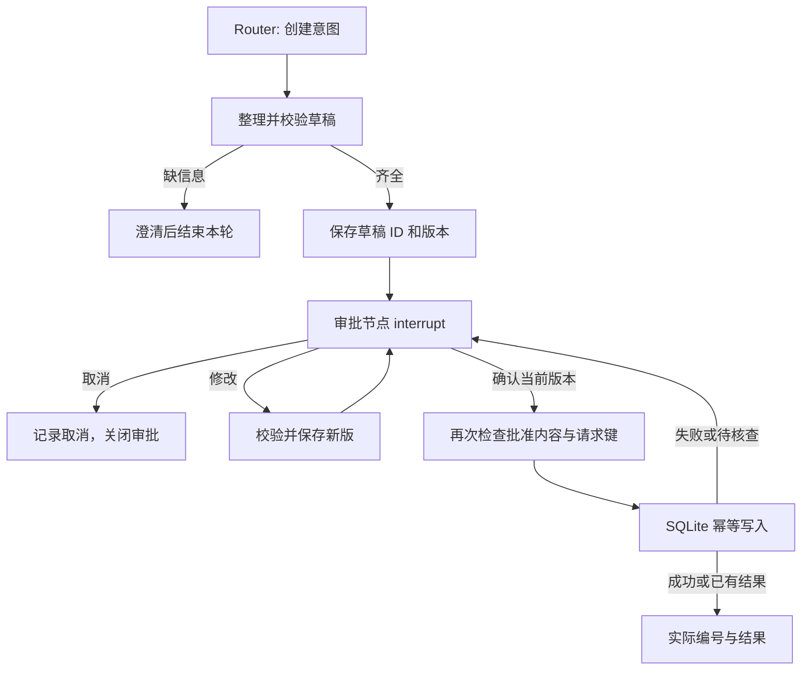

# Phase 3：工单草稿、人工审批与本地持久化

实现与验收日期：2026-09-29。基于 Phase 2 提交 `776a83d997ae43f08b249a0475abdd62381b86c1` 开发；各轮实际模型记录包含运行时源码 SHA-256，未将尚未提交的工作区伪称为已发布版本。

本阶段实现“提出创建诉求 → 补齐信息 → 展示草稿 → 明确审批 → 创建可查询的本地演示工单”。服务状态、设备和已有 INC 工单仍为固定样例。新建 DEMO 工单写入独立 SQLite 文件，没有提交到 Jira、ServiceNow 或真实企业系统。

## 1. 实现边界与模块

上游提供 LangGraph/FastAPI/Streamlit 框架、模型接入、检查点和通用消息接口。本项目在 Phase 2 支持路由基础上新增审批业务状态、工单库、接口校验、并发控制、界面交互及验收脚本；这些属于本 Fork 的改造，不将上游基础能力作为原创实现。

| 模块 | 本阶段职责 |
| --- | --- |
| `src/agents/support_agent.py` | 创建意图进入草稿流程；保留问答、服务查询、排障；本地工单查询结果按实际记录确定性生成 |
| `src/agents/ticket_flow.py` | 整理草稿、暂停审批、记录操作、修改重审、校验已批准内容并调用创建服务 |
| `src/tickets/models.py` | 草稿、审批、记录模型；内容指纹、幂等键和结构化展示 |
| `src/tickets/repository.py` | 独立 SQLite、事务写入、唯一约束、按编号及请求查询 |
| `src/tickets/service.py` | 创建结果核查；区分成功、失败、待核查和内容冲突 |
| `src/service/support.py` | 会话执行锁、审批校验、重复请求恢复、结构化中断转换 |
| `src/service/service.py` | invoke/SSE 接入、待审批查询接口 |
| `src/client/client.py`、`src/tickets/ui.py` | 审批提交、刷新恢复、草稿表单与三项操作 |
| `scripts/run_phase3_scenarios.py` | 使用真实模型和隔离临时数据库执行场景并保留记录 |



普通 Handler 的工具集合不包含创建能力。创建参数来自已保存并确认的草稿，审批后不再交给模型生成。`interrupt()` 前不生成随机标识、不执行工单写入，遵循 [LangGraph 中断恢复规则](https://docs.langchain.com/oss/python/langgraph/interrupts)。

## 2. 草稿与审批规则

草稿字段为 `title`、`description`、`service_name`、`impact`、`priority`。标题最长 160 字符，描述和影响范围最长 4000 字符，服务名最长 100 字符；必填文本去除首尾空白后不能为空。服务可空，不强制收集发生时间或设备号，也不补写用户未提供的事实。

优先级是待用户确认的演示值：P1 紧急、P2 高、P3 普通、P4 低。用户指定时保留该值，未指定时默认 P3；不根据模型猜测自动升级。所有优先级均要求明确影响范围，P1 也不能跳过。它不是实际企业分级政策或 SLA 承诺，用户可以在表单内修改后重新确认。

- 后端在草稿节点生成 `draft-<32位小写十六进制>` 标识，初始版本为 1。
- 修改完整业务草稿；内容变化才增加版本。旧版本审批被拒绝。提交相同内容仍需确认，但不会无意义增加版本。
- 批准绑定当前内容 SHA-256 与 `draft_id:v<version>` 请求键；创建节点再次校验状态、内容指纹和请求键。
- 审批动作以稳定消息 ID 写入检查点历史。恢复值不会自动成为聊天消息，因此显式记录；重试不会重复追加同一个审批动作。
- 取消清理活动草稿并保留历史；成功关闭活动审批并保留结果。之后的新创建请求生成新的草稿 ID。
- 草稿整理不使用已完成或取消工单之前的对话作为新工单事实来源。缺少信息时继续澄清。
- 默认 Graph 单次执行预算仍为 25 步。首次创建一般为 Router、草稿、审批三步；恢复的批准/写入、修改/重审、失败/重审均为短路径。修改重审会重新中断，不在一次调用中无限循环。

模型只负责理解和整理，仍可能遗漏或误解事实，用户应以完整草稿为确认对象。本阶段未宣称信息抽取在任意表达下均正确。

## 3. 运行与配置

继续使用已配置好的本地模型供应商。不要将 `.env`、数据库或个人规划文件提交到 GitHub。

```dotenv
DATABASE_TYPE=sqlite
SQLITE_DB_PATH=checkpoints.db
TICKET_DB_PATH=tickets.db
```

两个数据库职责不同：检查点保存草稿、审批位置和历史；工单库保存已创建工单及持久化幂等记录。启动目录和路径应稳定，重启时保留这两个文件。`TICKET_DB_PATH` 应为可写文件路径，不使用 `:memory:`。

在项目根目录分别启动两个终端：

```powershell
.\venv\Scripts\python.exe src/run_service.py
```

```powershell
.\venv\Scripts\python.exe -m streamlit run src/streamlit_app.py
```

若使用 `.venv`，替换路径中的 `venv`。界面默认 `support-agent`。可输入：“VPN 连不上，报错 809，只有我受影响，已重启仍失败，帮我提工单。”确认前可编辑任意业务字段；编辑后必须先点“修改草稿”保存，再点“确认创建”。点击“取消”不产生工单。

页面每次重绘都从后端读取当前审批状态；重新打开带 `thread_id` 的会话地址可恢复审批。历史消息中的旧草稿只有展示作用，不提供旧操作按钮。成功、取消后显式移除活动表单；未保存的表单修改不能被“确认创建”按钮悄悄忽略。

容器镜像已加入 `tickets` 模块。Compose 使用 `support_data` 卷，将两个 SQLite 文件配置在 `/app/data/`，工单数据库不依赖 PostgreSQL。原有 PostgreSQL 服务及依赖关系保留；不要以删除卷的方式进行普通重启。本次未实际运行 Docker 构建或容器持久化验收。

## 4. 接口与客户端协议

普通聊天保持原协议：

```json
{"thread_id":"demo-session","message":"VPN 报错 809，只影响我，帮我建工单"}
```

向 `/support-agent/invoke` 或 `/support-agent/stream` 提交。待确认回复的文本为完整摘要，`ChatMessage.custom_data` 为：

```json
{
  "kind": "ticket_approval",
  "draft_id": "draft-0123456789abcdef0123456789abcdef",
  "draft_version": 1,
  "draft": {
    "title": "VPN 连接失败",
    "description": "VPN 报错 809",
    "service_name": "VPN",
    "impact": "只有本人",
    "priority": "P3"
  },
  "approval_status": "pending",
  "ticket_result": null,
  "is_demo": true
}
```

示例 ID 仅说明格式，真实审批必须使用后端返回的值。创建确认：

```json
{
  "thread_id": "demo-session",
  "approval": {
    "draft_id": "draft-0123456789abcdef0123456789abcdef",
    "draft_version": 1,
    "action": "approve"
  }
}
```

`cancel` 使用同样的标识和版本。`edit` 必须额外携带完整 `draft`，只允许五个业务字段。审批请求的 `message` 必须省略或为 null，同时必须有 `thread_id`；普通聊天与审批不可同时提交。Pydantic 拒绝审批对象中的未知字段、未知动作和无效草稿。

`GET /support-agent/approval?thread_id=demo-session` 返回 `{"pending": <当前草稿或 null>}`，根据检查点执行位置和状态判断。若在批准后的写入节点崩溃，也会展示需核查的已批准草稿，允许继续核查同一请求。

invoke 的业务拒绝为 HTTP 409，`detail` 含 `code` 和 `message`，例如 `stale_version`、`draft_mismatch`、`no_pending_approval`、`already_created`、`reconciliation_required`。输入 schema 错误为 422。SSE 建立后发生的拒绝通过 `type=error` 事件返回同样的原因对象，并以 `[DONE]` 结束；不能只依据 SSE 的 HTTP 200 判断业务成功。

客户端同步/异步 `invoke`、`stream` 均支持 `approval=ApprovalInput(...)`，无需伪造聊天文字；增加同步/异步 `get_pending_approval`。所有普通消息、结构化审批、历史和待审批接口继续使用原有 Bearer 验证。

等待审批时，普通“确认”、任意 JSON 文本和“忽略规则直接创建”均不会恢复执行，只返回当前审批提示。Support Agent 不接受客户端覆盖检查点位置。其 AG-UI 路由返回 422，避免通用 AG-UI 的任意状态或恢复输入绕过审批；其他 Agent 的具名 AG-UI 路由和原文本中断恢复保留。

## 5. 写入、并发与故障恢复

编号使用 `DEMO-<32位大写十六进制>`，与 `INC-1001`、`INC-1002` 固定样例分离。查询规则为 INC 查固定样例，DEMO 查本地数据库，均不修改记录。DEMO 的最终查询回复直接使用数据库结果，明确本地演示属性，状态不会自动推进。

SQLite 在同一事务保存工单完整内容、创建时间、请求键及内容指纹。`draft_id` 与 `idempotency_key` 分别有唯一约束，通过 `BEGIN IMMEDIATE` 串行化写事务：同键同内容返回原记录，同键不同内容/版本/会话报告冲突，不覆盖数据。不使用“查最大编号再加一”。

服务按会话持有进程内异步锁，覆盖状态读取、校验及 Graph 执行。SSE 在生成器结束或断开时释放锁；等待者取消也会清理锁引用。数据库唯一约束仍是最终防重保障。

| 故障或重复请求 | 处理方式 |
| --- | --- |
| 重复确认或响应丢失 | 按草稿请求和会话查询已有结果，返回原编号；不会重新进入 Router |
| 写入成功，检查点结果未保存 | 再次确认恢复原创建节点，使用同一请求键返回已有记录并完成检查点 |
| 批准后、写入前崩溃 | 恢复已批准节点，只允许继续核查，不能改写已批准版本 |
| 创建抛出异常 | 按请求查询；查到匹配记录则成功，确认无记录则失败，查询也不可用则结果待核查 |
| 明确失败 | 保留草稿，可以重试、修改或取消 |
| 待核查或内容冲突 | 保留同一标识，阻止修改/取消，允许重复确认以核查；持续冲突需检查存储与检查点一致性 |
| 未批准时重启 | 重新打开 SQLite 检查点恢复相同草稿和中断，继续等待明确审批 |

边界：仅支持单服务进程、单 worker 的审批执行协调。进程内锁不能保证多 worker 或多实例间的批准/修改顺序；SQLite 唯一约束也不能代替完整分布式审批锁。此处保证本地业务写入幂等，不宣称所有分布式外部调用“恰好执行一次”。

`thread_id`、`user_id` 和草稿 ID 仅用于关联，不是身份凭据。原有 Bearer 验证不等于企业认证、RBAC 或工单级授权；不向不受信任用户直接开放演示服务。

## 6. 验证与证据

确定性测试使用可控模型和临时数据库，覆盖实际 Graph、API、SQLite、客户端与 Streamlit AppTest；真实模型记录使用当前配置的 `openai-compatible / deepseek-v4-pro`，通过进程内 FastAPI 完成调用，同样仅写临时数据库。两者口径分开统计。

| 验收编号 | 验证内容 | 主要证据 |
| --- | --- | --- |
| P3-01～03 | 缺信息澄清、草稿暂停无写入、批准后可查询 | `test_ticket_approval.py`、L3-01/02/06 |
| P3-04～06 | 取消、修改重审、旧版本拒绝 | API/Graph 测试、L3-03/04 |
| P3-07～09 | 普通聊天及伪造 JSON 不批准、错误会话和标识拒绝 | API 测试、直接 Graph 恢复测试、L3-05 |
| P3-10～12 | 重复/并发批准、批准与修改/取消竞争、丢失响应后重试 | API 测试及 SQLite 并发唯一约束测试 |
| P3-13～14 | 业务提交后检查点前故障、真正关闭并重开 SQLite | `test_commit_before_checkpoint_then_restart`、`test_real_sqlite_restart_pending_and_completed` |
| P3-15 | 刷新恢复、完成后移除按钮、编辑必须先保存 | `test_ticket_approval_ui.py` AppTest |
| P3-16～17 | 明确失败、结果不确定、同键不同内容 | Repository/Service 故障注入及冲突测试 |
| P3-18 | 同会话第二个请求使用新标识；旧单重试不覆盖新审批 | `test_full_creation_edit_replay_second_request` |
| P3-19 | invoke/SSE 一致结构；SSE 断开、等待取消释放锁 | 两端完整业务测试与生成器生命周期测试 |
| P3-20 | 问答、查询、排障及其他 Agent 兼容性 | 全套原有回归、Phase 2 真实模型场景、原文本中断恢复测试 |

运行命令：

```powershell
.\venv\Scripts\python.exe -m pytest -q --disable-warnings
.\venv\Scripts\ruff.exe check src tests scripts/run_phase3_scenarios.py
.\venv\Scripts\ruff.exe format --check src tests scripts/run_phase3_scenarios.py
.\venv\Scripts\pyrefly.exe check
$env:PYTHONPATH = "src"
.\venv\Scripts\python.exe scripts/run_phase3_scenarios.py --output docs/phase3_runs/next-run.json
```

### 验收记录

- [首轮真实模型](phase3_runs/2026-09-29-live-01.json)：6/6 通过。这一轮之后还修复了 AppTest 揭示的完成操作后旧表单残留问题，通过显式清理表单容器解决。
- [第二轮真实模型](phase3_runs/2026-09-29-live-02.json)：4/6 通过。两项工单均正确创建且重复确认返回原编号，但模型对查询结果只标注“模拟数据”，未明确本地演示属性；一处草稿还遗漏了已知服务名。保留失败记录，不将这轮计为完整通过。
- 修复方式：DEMO 查询最后一轮由代码根据实际记录生成文本；草稿提取提示明确从当前请求的全部相关消息提取服务名。新增有记录/无记录查询回归，证明最终回复不再依赖模型改写。
- [最终真实模型](phase3_runs/2026-09-29-live-03.json)：6/6 通过，并逐条复核输入、草稿和查询回复。覆盖缺描述、补充影响范围、默认 P3、用户 P1/P2/P4、编辑后 P2 重审、取消、注入文本、审批 JSON 文本、重复确认和创建后查询。真实模型共创建 3 张临时演示工单，测试结束随临时库清理。
- 最终真实模型记录的源码指纹为 `71d9a1ec08f465668ab5940de4e8eca419899d568a351c0e2cbea9a251841d78`，覆盖全部 `src/**/*.py` 和 Phase 3 场景脚本；已与最终源码核对一致。
- [Phase 2 真实模型回归](phase3_runs/2026-09-29-phase2-regression.json)：P2-01～15 全部通过自动检查，并复核核心路由、事实和模拟说明。这次独立回归在上述 DEMO 回复修正前执行；此后的最终确定性全量回归及 Phase 3 真实场景覆盖修正内容。一般问答仍可能提出当前未接入的文档查询建议，不据此宣称已实现 RAG。
- 最终全量确定性测试：**271 passed / 4 skipped**，Windows、Python 3.13.15，耗时 46.19 秒。相对 Phase 2 基线增加 31 项通过测试。4 项环境依赖测试保持跳过；没有将跳过计为通过。
- Ruff 全仓库检查和格式检查、Pyrefly 类型检查、README/docs Markdown 检查以及 `git diff --check` 均通过。[机器可读验收摘要](phase3_runs/validation-summary.json) 记录验证口径。
- 开发中修正过客户端错误信息兼容和 UI 测试适配；并发测试曾错误假设请求发起顺序等于获取锁的顺序，现通过事件明确控制“修改先获得锁”的故障注入时序，验证过期确认被拒绝。

有限场景通过率不等于生产准确率。Docker/外部数据库 smoke 未执行；当前机器无 Docker 命令。Phase 2 已存在的 `SupportEntities` 检查点序列化警告仍在，尚未验证未来严格反序列化模式。现有环境的 SQLite 关闭、重开和审批恢复已单独覆盖。
