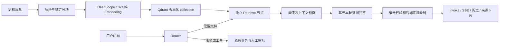

# Phase 4：可追溯的 Qdrant Dense RAG

开发与验收日期：2026-09-30。在 Phase 3 提交 `2ab5411df8ed466d436552e06591b5371a830734` 基础上开发；本阶段代码尚未发布，实际模型记录保存启动时源码摘要。上游 LangGraph/FastAPI/Streamlit 框架继续保留，本 Fork 新增知识流水线、显式检索、引用约束和实测基线。

## 1. 已实现的链路



公司制度和故障排障显式检索；普通概念可直接回答。服务运行情况来自只读模拟工具，工单查询/创建保持 Phase 3 边界。`search_known_issue` 留作历史固定样例，已从正式 Agent 工具允许列表移除。上游 Chroma 示例不改为本企业知识库。

| 模块 | 职责 |
| --- | --- |
| `src/rag/config.py`、`models.py` | 独立配置、元数据、错误和结果契约 |
| `loader.py`、`chunker.py` | 显式清单、基础格式解析、位置、稳定 ID |
| `embeddings.py` | 独立凭据、批处理、向量校验、有限重试、真实用量 |
| `vector_store.py`、`ingestion.py` | collection/模型契约验证、全量构建、失败状态、幂等复用 |
| `retriever.py` | 查询向量化、Top K、筛选预算、耗时、错误降级 |
| `answers.py`、`ui.py` | 不可信证据提示、引用映射、来源卡片 |
| `src/agents/support_agent.py` | 四类意图增加 knowledge_required / retrieval_query，独立检索节点 |
| `scripts/ingest_knowledge.py`、`evaluate_dense.py` | 显式入库、开发/留出集基线 |
| `scripts/run_phase4_scenarios.py` | 真实聊天模型、接口/审批回归、受控冲突与注入场景 |

## 2. 配置和运行

先按仓库说明安装 Python 3.13 环境和依赖：`uv sync --frozen`。新增 `qdrant-client~=1.19.0` 和显式 `openai~=2.54.0` 依赖；锁文件只增加 Qdrant 与 portalocker，保留 14 天发布冷却规则，没有全面升级依赖。

将 `.env.example` 的 Qdrant/DashScope 字段填写到本地 `.env`，聊天模型仍使用原有独立配置。不得将密钥或个人集群地址写进示例与报告。

| 配置 | 基线 |
| --- | --- |
| `QDRANT_COLLECTION` | `enterprise_support_dense_v1` |
| `QDRANT_VECTOR_SIZE` / `EMBED_DIMENSIONS` | 都为 1024；启动检索前校验 |
| `QDRANT_DISTANCE` | cosine |
| `EMBED_MODEL_TYPE` / `EMBED_MODEL_NAME` | dashscope / text-embedding-v3 |
| `EMBED_BASE_URL` | DashScope 北京 OpenAI 兼容地址，见示例 |
| `EMBED_BATCH_SIZE` | 10，禁止超过 10 |
| `EMBED_TIMEOUT` / `QDRANT_TIMEOUT` | 30 秒 |
| `RAG_CHUNK_SIZE` / `RAG_CHUNK_OVERLAP` | 800 / 100 字符，长段落内重叠 |
| `RAG_TOP_K` / `RAG_MIN_SCORE` | 5 / 0.65，阈值仅用 dev 选择 |
| `RAG_CONTEXT_CHARS` / `RAG_SNIPPET_CHARS` | 4500 / 1000，证据 JSON 内容预算与单块上限 |
| `RAG_TIMEOUT` | 单次检索总时限 90 秒 |

```powershell
# 已激活虚拟环境，在仓库根目录执行；报告使用新文件名保留历史
python scripts/ingest_knowledge.py --report .cache/ingestion-new.json
python scripts/evaluate_dense.py --split dev --calibrate --output .cache/dense-dev-new.json
python scripts/evaluate_dense.py --split heldout --threshold 0.65 --output .cache/dense-heldout-new.json
python scripts/run_phase4_scenarios.py --output evaluation/results/phase4/agent-new-run.json --budget-cny 50
python src/run_service.py
# 另一终端
streamlit run src/streamlit_app.py
```

在界面选择 `support-agent`，可问“公司 VPN 使用有哪些要求？”或“VPN 报错 809，设备 DEV-001，如何排查？”。知识问答先检索并校验完整回答，再发最终消息；为防止未校验内容泄漏，不逐 token 流出该类模型回答。SSE 仍可正常发送业务消息，引用元数据与 invoke、历史记录一致。

RAG 配置按首次使用延迟读取；缺失/错误时知识问答报告检索不可用，服务查询与工单流程仍可运行。更新配置后重启服务刷新客户端。模型仍必须支持结构化路由与工具调用。

## 3. 语料、分块与索引

语料明确标记 **Synthetic enterprise support dataset / public technical documentation**。20 篇文档中 18 篇为自行编写的演示制度或指南，2 篇是带官方链接、获取日期、使用依据的原创简短摘要；不是企业真实内网资料。[语料清单](../data/knowledge/manifest.json) 包含稳定文档 ID、标题、版本与出处。

仅加载清单指定文件，拒绝越出根目录、隐藏路径和 personal。Markdown/TXT 保留章节与行位置；基础文本 PDF 保留页号；DOCX 保留正文段落号，不编造页码。空文件、非法文本、未知格式、扫描 PDF 无文本页均使本次构建失败。OCR、复杂表格、多栏恢复不支持；DOCX 表格不作为当前正文加载范围。

分块优先按段落，长段落再按字符窗口切分，不合并不同短段落。当前语料短，形成 40 块；800/100 尚未经过参数优选。chunk_id 包含文档 ID/版本及位置与内容指纹，转换为 UUID point ID。标题进入文档向量化输入，正文和来源随 payload 保存。

字符分块限制与模型 token 限制分开处理。发送前另外采用每条最多 8000 UTF-8 字节的保守输入限制，为 8192-token 接口上限留余量；这不是精确 tokenizer 计数，更不能作为账单用量。批量最多 10 条，显式 float/1024 维，检查顺序、数量、有限数值、非零向量。认证/维度失败不重试；连接、超时、429、服务暂时故障最多 3 次尝试。

collection 保存独立保留点作为索引 manifest，普通检索按 kind=chunk 排除它。记录所有者、语料指纹、模型提供商/名称、维度、距离、预处理/分块版本、构建时间和状态。总点数 41，其中可检索分块 40。当前索引指纹：

```text
47b61e7889b8d24ebf8ed1c9e61770abbb52ae002d49753d47f3346b2b26df93
```

同输入再次导入复用 ready 索引，实测 0 次 Embedding 调用。改变文档、删除文档、修改分块配置等需新 collection，例如 `--collection enterprise_support_dense_v2`。未知 collection、同维度但模型/配置不符或不同语料版本被拒绝。不能仅因维度相同就混用向量。

先完整解析，再构建新版本；部分向量写入失败只保留 failed/building 状态，不可检索。重试同版本通过稳定 ID 覆写，不产生重复点。成功后明确修改 `QDRANT_COLLECTION` 并重启才能启用，不自动切换或删除旧版。更新/删除内容后新版本不返回旧块已通过隔离客户端测试；正式云端已验证首次构建、查询和同输入复用，未额外创建永久 v2。

首次云端探针只创建并删除本次生成的临时 collection，已有两个 collection 保持原样。未升级 Qdrant 套餐，也未启动本地 Qdrant 服务。

## 4. 证据、回答和失败边界

每次路由先清空上一轮 retrieval，续问只改写当前查询。返回证据携带实际索引版本、文档/分块 ID、版本、章节/页号/段落、内容指纹、相似度、原始公开 URL。相似度筛选与 JSON 证据预算之后才提供给模型。

文档被标为不可信数据，不得扩大工具权限或批准工单。来源冲突必须呈现双方；缺少的事实不得补造。合成资料明确写“演示制度”，模拟服务状态不得当作真实可用性。编号映射来自后端，模型自行生成 URL、引用不存在编号或不给编号时会拒绝原回答，仅展示候选。编号合法不证明语义支持，所以另做原文审阅。

前端“回答引用”和“候选资料（未作为回答引用）”分开展示，显示标题、摘要、来源类型、文档版本、位置及 ID；仅公开 HTTPS 来源提供外链，不暴露绝对本地路径。检索失败说明暂不可用，空结果/低分说明证据不足，二者不能混为“库里没有”。

当前失败降级较保守：知识排障检索不可用时直接说明无法可靠回答，不继续生成无来源排障建议；独立服务/设备业务与工单分支保持原有能力。纯粹无法回答但不附任何引用的模型输出也可能被编号检查替换成通用拒答，这是可用性限制。

## 5. 实测结果及不足

48 条问题在实验前分为 dev/heldout，各 20 有答案、4 无答案。阈值在 dev 的 0.30～0.80 候选中按有答案覆盖率与无答案排除率均值选择，平分优先覆盖率、再取低阈值；冻结为 0.65 后运行 heldout，未反向调参。

| 指标 | 结果 |
| --- | --- |
| dev 候选文档 Recall@5 / MRR@5 | 1.0 / 1.0，20 条有答案 |
| heldout 候选文档 Recall@5 / MRR@5 | 1.0 / 1.0，20 条有答案 |
| heldout 过滤后正确证据覆盖 | 15/20，即 75% |
| heldout 无答案仍有证据返回 | 1/4；不等于模型已编造答案 |
| heldout 向量化平均 / P95 | 0.266 / 0.333 秒 |
| heldout Qdrant 查询平均 / P95 | 0.504 / 0.557 秒 |
| heldout 整体检索平均 / P95 | 1.525 / 1.797 秒 |
| 首轮真实模型 12 场景，14 次自然语言请求 | 接口/流程检查通过；完整链路平均 9.047 秒，P95 13.556 秒 |
| 真实模型补充与修正复测 | 5 个补充场景及 2 次针对性复测，记录全部保留 |

检索延迟样本数均为 24，P95 用 nearest rank；Windows 客户端连接北京 Embedding 和欧洲 Qdrant，包含网络、首请求冷启动及有限重试，整体检索还含索引检查。小样本不是生产 SLA。候选文档指标先取 5 块、映射文档、稳定去重再截断，不额外补取；无答案不进入 Recall/MRR 分母。

主要不足是小语料/小样本，以及保守阈值导致正确证据被过滤。P1 多问只回答了审批与无 SLA，没有完整解释优先级条件。人工核对还发现一次合法引用下的无依据概率推断；已加强提示词并通过针对性复测，原始失败措辞保留。详见[回答支持性审阅](../evaluation/results/phase4/answer-review.md)和[评测资产说明](../evaluation/README.md)，不把“17 个自动场景检查通过”包装成所有回答事实都正确。

## 6. 成本和验证范围

用户授权本阶段费用上限 50 元。全部真实调用的已报告用量和保守估价见 [cost-summary.json](../evaluation/results/phase4/cost-summary.json)。聊天用量约 0.67 元，Embedding 不足 0.01 元，合计约 0.67 元；没有充值或付费升级。未取得控制台账单、余额和免费额度有效期，因此不宣称这是实际扣款，也不假设账户拥有免费额度。现有 Qdrant 集群的账户级固定费用不在 token 估价中。

DashScope 使用当日北京参考价 0.0005 元/千输入 tokens；聊天使用 DeepSeek V4 Pro 的峰时输入未命中缓存 9 元/百万、输出 27 元/百万保守估算，不扣除缓存或错峰折扣。脚本记录实际 usage，限制输出和重试，在报告目录累计已记录聊天估价并保留 5 元余量。该保护依赖保留报告，无法代替供应商账单或限制其他程序消费。

验证覆盖解析格式、稳定 ID、重复入库、索引不兼容、部分失败、更新后旧块消失、HTTP Embedding 契约、有限重试、证据预算、编号错误、文档恶意工具调用拒绝、来源卡片实际 Streamlit 组件渲染、invoke/SSE/历史、多轮清空和原有审批回归。工具调用前附带的未校验回答也会在写入历史/SSE 前清空。自动测试默认隔离云调用，不能代替本目录真实云端记录。

最终全量测试 **304 passed / 4 skipped**，18 项依赖警告；4 项跳过为现有 Docker 测试。Ruff、格式检查、Pyrefly（0 errors，保留既有 11 项抑制和 3 项隐藏警告）、Markdown 和 `uv lock --check --offline` 均通过。公开文件扫描未发现本地密钥或个人 Qdrant 地址；`personal/` 和 `.env` 未跟踪。

依赖锁检查通过，开发环境为已有 Windows venv；其中部分上游依赖版本与锁文件不同，未为本阶段全面替换。正式冻结环境的完整安装/验收留待部署验证，不把现有环境测试声称为锁定环境测试。Dockerfiles 已复制 `src/rag/`，Compose watch 同步更新；本阶段未执行镜像构建、容器部署或完整浏览器端交互验收。Phase 9 再验证完整部署、持久化与恢复。

本阶段不包含 BM25、混合检索、重排、自动同步、OCR、生产文档权限、多租户或真实工单系统集成。personal 文档和凭据保持本地。

## 7. 参考资料

- [阿里云 Embedding 接口与限制](https://help.aliyun.com/en/model-studio/embedding-interfaces-compatible-with-openai)
- [阿里云向量化模型与价格](https://help.aliyun.com/zh/model-studio/embedding)
- [Qdrant collections](https://qdrant.tech/documentation/manage-data/collections/)
- [Qdrant Python client](https://github.com/qdrant/qdrant-client)
- [DeepSeek 官方定价](https://api-docs.deepseek.com/zh-cn/quick_start/pricing/)
