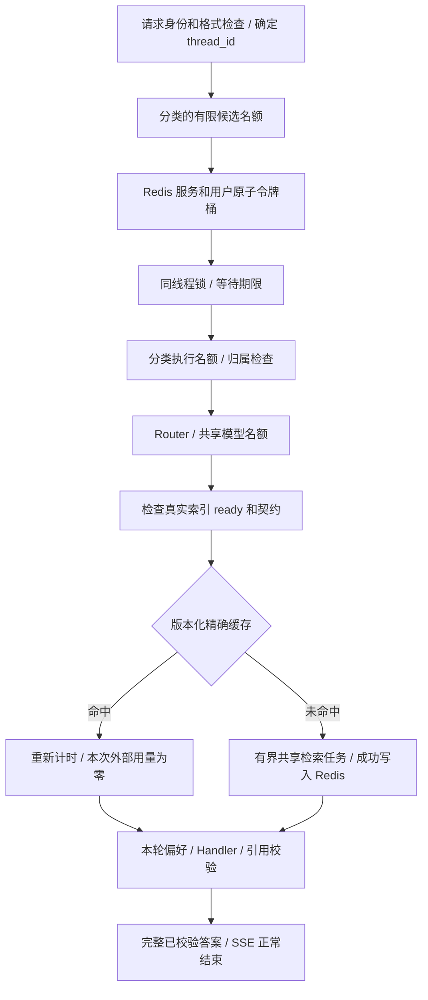

# Phase 7：精确检索缓存、有界并发与性能验收

实现日期：2026-10-02。阶段预算 10 元；实际报告用量的保守估价合计 **0.7227385 元**，不是供应商账单。仅支持单应用 worker。当前工作区已经启用本地 Redis 缓存和准入控制；公开 `.env.example` 默认关闭，部署者启动 Redis 后明确开启。

## 1. 实现与边界

本项目在 Phase 6 已经使用异步 FastAPI、SSE 和三个 PostgreSQL 连接池。本阶段增加执行控制，不改变知识库分块、Dense20/v2、0.65 门槛、最终 5 条证据、Router/Handler 提示词和引用校验要求。



`src/execution/` 负责生命周期、原子限流、准入、取消、模型名额及计时；`src/rag/cache.py` 负责缓存和相同未命中合并。Support Agent 的 invoke、stream、history、threads、审批查询、工单列表和偏好接口接受入口控制。上游其他示例 Agent 不属于本阶段执行保护范围；Support Agent 的 AG-UI 入口继续拒绝调用。

### 精确缓存

- 只用于非 legacy Dense 路径。其余检索模式绕过缓存；最终回答、偏好、工单及审批状态不缓存。
- 使用 Router 实际输出的检索问题，采用 `identity-v1` 原样匹配。空格、数字、否定词、错误码变化会改变键，不做模糊合并。
- 键由 schema、查询、实际 collection、完整 manifest 和去除四个密钥字段后的全部 RAG 配置产生 SHA-256。这样覆盖模型、预处理、快照、索引版本、候选数量、筛选和上下文预算；超时等非语义参数也会保守地导致失效。
- **每次命中前仍访问后端检查 ready、snapshot 和模型契约**。冷请求还会执行原检索中的检查，因而存在额外一次索引读取；这是本版保留原检索边界的成本。
- JSON 使用结构模型、schema、查询/版本/来源检查、摘要和重新证据筛选验证。摘要用于损坏检测，不是针对 Redis 管理员篡改的认证机制。错误、降级和超时结果不写入成功缓存。
- TTL 默认 300 秒、条目最大 256 KiB；新配置产生新键，旧条目自然过期。Redis 限制 64 MiB、`noeviction`，避免随意逐出限流状态；写满时缓存降级，限流写失败则关闭新问答入口。
- 命中重新计时，Embedding 请求/token/retry 为零；共享任务仅由一个成功消费结果的等待者计入实际用量。共享任务完成后复制结果，避免请求互相改写元数据。
- 当前共享演示语料允许跨会话命中。未来私有文档必须加入权限范围和权限版本，不能沿用当前键。

每个 worker 最多 8 个在途检索任务、32 个等待者。共享任务有独立的最长 90 秒预算，同时受原 RAG 预算约束。单个等待者取消不会取消其他等待者；最后一个退出立即移除登记并取消、等待清理底层任务。最后退出时先移除登记，避免新请求加入正在清理的旧任务。

### 准入与错误

| 资源 | 初始参数 | 行为 |
| --- | --- | --- |
| 普通问答 | 执行 6、候选等待 12 | 总候选数最多 18 |
| 审批/确认/取消 | 执行 3、候选等待 8 | 独立于普通问答 |
| 历史/偏好/核查等读取 | 执行 4、候选等待 8 | Redis 故障时本地有限容量仍有效 |
| 模型 | 同时 3 | Router、草稿整理、Handler 共用；审批中的模型也受限 |
| 等待 | 执行队列 3 秒、同线程锁 2 秒 | 不把同线程等待者放进执行名额 |
| 整体请求 | 120 秒 | 包含等待与执行；阶段超时仍生效 |
| Redis | 超时 0.5 秒、池 24 | 无命令自动重试 |

三类执行总上限为 13；“问答执行 6”不是整个服务所有类别相加后的上限。不同分类都保留有限候选空间。参数是工程起点，不是压测得到的最优值。

Lua 使用 Redis TIME，一次完成服务桶和声明用户桶的补充、判断、扣减和 TTL 设置。问答的服务桶容量/每秒补充为 40/20，用户桶为 20/10；审批乘 2、读取乘 3。两桶都可用才同时扣减；任一拒绝不扣另一桶、不创建新用户状态。TTL 为容量完全补充时间的两倍。已经通过速率检查、后来等待超时的请求不退令牌；这控制的是入站尝试而非计费成功数。

| 状态 | 对外结果 |
| --- | --- |
| 速率拒绝 | HTTP 429、`rate_limited`、Retry-After |
| 候选队列满 | HTTP 503、`queue_full` |
| 等待耗尽 | HTTP 503、`thread_busy` / `execution_wait_timeout` |
| 新问答遇到 Redis 整体故障 | HTTP 503、`rate_dependency_unavailable` |
| 审批和读取遇到 Redis 故障 | 保留有限的本地执行通道 |
| 缓存 GET/SET 失败 | 有界重算并记录 `unavailable`；不虚构命中 |
| 整体/模型超时 | HTTP 504，或已开始 SSE 中的结构化 error |
| 客户端断连 | 取消请求并释放资源；日志记 `disconnected` |

声明用户 ID 不是认证，令牌桶不能据此提供防身份冒用的租户配额。入口不会自动重试整图。Redis 重启会重置临时速率状态；工单权威与防重仍在 PostgreSQL。

### SSE 与连接生命周期

Support SSE 使用同一个请求任务执行和关闭图迭代器，由入口监控实际 `http.disconnect`。开发期间真实网络测试暴露了通用 StreamingResponse 的任务取消与图任务清理组合问题；改为明确的取消所有权后重新通过网络测试。`CancelledError` 继续传播，不能伪装成业务成功。

流开始前做格式、身份、归属和准入检查；开始后错误为 error 事件。客户端区分 HTTP 异常、SSE error、`[DONE]` 和没有 DONE 的意外断流。心跳/未知进度不当作答案或结束。知识回答始终完整生成并校验后输出，TTFT 记不适用。

`AgentClient` 同步实例复用 HTTP 池并支持 `close()` / 上下文管理；异步使用显式 `AgentClient.session()`，在同一事件循环的作用域内共享池。Streamlit 每次运行创建并关闭这个作用域，不跨运行保存 AsyncClient。客户端默认读等待为服务预算加 10 秒，连接/写/池等待分别为 5/10/5 秒；异步调用另有总期限。没有单独归因 HTTP 连接池改造的收益，下面服务驱动始终复用自己的 HTTP 连接。

即使请求被取消，已提交的工单仍可能存在。响应丢失后使用原 `draft_id`、版本和会话核查，不重新生成创建请求。没有持久后台作业保证。

取消途中已经发出的上游调用可能计费；没有返回用量时不能按零消费结算，仍需对照供应商记录。本阶段付费样本均正常返回用量，取消压测使用确定性组件。

## 2. 计时与实验约定

请求日志 `support_request` 只包含 request_id、run_id、类别、状态、终止原因、总耗时和阶段耗时，不记录完整问题或密钥。使用单调时钟。阶段包括限流、线程等待、执行等待、模型等待、归属、业务数据库、偏好、Router/草稿/Handler、最终校验和发送；RAG 元数据包含索引检查、缓存 GET、共享等待、Embedding、Qdrant、SET 和本次检索总耗时。

数据库计时包含必要连接等待；模型阶段包含 SDK/供应商等待；应用名额等待单列。嵌套/并发阶段不可直接相加。HTTP Server-Timing 只能包含发送响应头时已经产生的计时，完整结果以请求完成日志为准。

Phase 6 基线为 `ed0d91131e7c805ee06253d04c4d415fcd92cc6d`，开始时工作区干净；公开摘要在 `evaluation/baselines/phase6/manifest.json`，本地归档在 `.cache/phase7-baseline`。基线用归档源码运行，依赖环境仅增装 Redis 客户端，原依赖未升级。

最终服务数据位于 `evaluation/phase7/final/`，每次进程启动保存源码、驱动和 fixture 字节摘要。四组为归档 Phase 6、仅缓存、仅控制、完整方案；单 worker，真实 HTTP/PostgreSQL/Redis，确定性模型和检索后端。三个 PostgreSQL 池各 1 个连接、合计最大 3 个，未增大连接数换吞吐。

主机为 Windows、AMD Ryzen 7 6800H（16 个逻辑处理器），Python 3.13.15；PostgreSQL 17.11 为本机进程，Redis 在 Ubuntu 24.04 WSL，检索与真实聊天依赖远程供应商网络。

- 主矩阵：每批 50/100，请求并发 5/10/20，五种工作负载，共每组 30 批、2250 请求。
- 工作负载：全不同、同时冷热点、预热热点、10 种问题固定重复、同线程串行；混合比例分别为 50 请求的 80% 和 100 请求的 90% 重复。
- 每批不同查询前缀；仅 hot 预热 1 次，不计入测量区间。其余无预热。记录请求顺序和实际检索查询/键摘要。
- 闭环 semaphore 驱动，HTTP 连接复用。令牌桶跨同一进程的相邻批次延续，后续批次拒绝率会受前一批消耗影响。
- 顺序执行四组，然后反向顺序重复每组 50 请求、并发 10 的五种负载。重复轮是选定切片，不是整个矩阵重复。
- 开发期间根目录 `service-*.json` 属于探索记录；最终对比以 `final/` 为准。完整最终矩阵串行运行期间不运行其他压测或付费回归。
- P50/P95 使用排序后 `floor((n-1)*p)`，有限样本、单机回环和本地 WSL 环境，不表示生产 SLA。成功吞吐只计通过知识编号校验的响应；失败延迟和原因另列。编号合法不等于语义正确。

## 3. 真实检索与真实 Agent 结果

最终服务矩阵与重复切片共 **10,000 个计入测量的请求**。以 100 请求 / 并发 20 / 已预热热点为例：

| 模式 | 成功 / 总数 | 成功请求每秒 | 成功 P95 秒 | Embedding / 搜索调用 | 限流 / 容量拒绝 |
| --- | --- | --- | --- | --- | --- |
| Phase 6 基线 | 100 / 100 | 31.56 | 0.715 | 100 / 100 | 0 / 0 |
| 仅缓存 | 100 / 100 | 30.59 | 0.750 | 0 / 0 | 0 / 0 |
| 仅控制 | 11 / 100 | 18.40 | 0.506 | 11 / 11 | 85 / 4 |
| 完整方案 | 10 / 100 | 21.84 | 0.441 | 0 / 0 | 88 / 2 |

这组本地服务样本中，缓存消除了热点外部检索调用，却没有提高成功吞吐；完整方案较低的成功 P95 不能当作整体提速，因为拒绝了多数突发请求。控制组与完整组的进程累计模型峰值均为 3，批次结束名额全部归零。50 请求 / 并发 10 的热点重复切片中，基线和仅缓存分别约 31.06 和 30.72 成功请求/秒，完整组成功 9/50、限流 41；保守的当前速率参数不是最佳吞吐配置。

其余工作负载和成功/失败延迟分布见 `summary.json`。例如仅缓存组 100 请求 / 并发 20 的全部不同查询仍调用 100 次 Embedding，成功吞吐约 21.58 请求/秒；不能把热点结果推广到无复用负载。当前选型保留有限资源与明确拒绝，后续应按真实业务流量调整公平性与速率，再独立重测。

真实检索对比固定 3 个查询、2 轮、18 次检索，使用原 Qdrant Cloud/v2 快照和 DashScope text-embedding-v3。保留冷启动与网络波动，不删除较慢的第一条：

| 模式 | 样本 | 平均秒 | P50 秒 | Embedding 请求 |
| --- | --- | --- | --- | --- |
| 无缓存 | 6 | 1.267 | 0.995 | 6 |
| 冷缓存 | 3 | 1.568 | 1.576 | 3 |
| 热缓存 | 9 | 0.522 | 0.521 | 0 |

命中前仍有远端索引检查，因此热缓存不是零网络开销。所有命中/未命中的证据等价；冷缓存额外索引检查在这些样本中有成本。不能把热缓存检索降时比例写成 Agent 整体加速。

真实模型使用 DeepSeek v4 pro、温度 0、最多输出 1200 token、无自动重试。相同 VPN 问题交错运行：关闭新增开关的当前源码 4 次平均 **9.657 秒**，完整方案 4 次平均 **9.677 秒**，后者 1 次 miss、3 次 hit；**没有观察到明确的端到端提速**。这是执行开关对照，不是另起旧源码的真实模型测试。全部 8 条来源编号校验通过，真实 Router 在本组恰好生成相同查询；不能推广为所有重复问句都会命中。

额外 2 条检查确认缓存命中时英文偏好仍生效、P1 短问题仍存在检索证据不完整的老问题。未改提示词或门槛修饰结果；Phase 5 冲突回答的无依据扩展也仍是已知限制。本阶段不是新的全面回答质量评测。

成本：真实检索 0.0000705 元，真实 Agent 0.722668 元，合计 0.7227385 元。使用此前核定的保守未缓存单价输入 9 / 输出 27 元每百万 token、Embedding 0.5 元每百万 token；账单、免费额度、供应商缓存折扣没有据此推算。价格参考 [DeepSeek 定价](https://api-docs.deepseek.com/zh-cn/quick_start/pricing/) 与 [百炼 Embedding](https://help.aliyun.com/zh/model-studio/embedding)。本次 DeepSeek 定价页面读取超时，沿用历史保守估价而不声称重新核验了当日单价。

## 4. 故障与回归证据

| 记录 | 实际验证 |
| --- | --- |
| `redis-verification.json` | 真实 TTL 过期重算、坏值、索引状态优先、100 并发仅放行 7 次、双桶不半扣、Redis TIME 补充和过期 |
| `network-verification-v2.json` | 实际 SSE / invoke 中途断连、资源归零、原线程可复用、线程忙碌、流前 422 / 流后期限 error |
| `redis-outage-verification.json` | 真实连接不可达时新问答 503、读取可用、无模型调用 |
| `storage-regression.json` | 新控制开启后的 Phase 6 审批、隔离、取消不写、偏好删除和提交后崩溃恢复 |
| `storage-redis-restart-v2.json` | 专属 16380 Redis 停机时重复批准返回原工单，重启后仍同一工单；同时重跑提交后崩溃恢复 |
| `tests/execution/` | 单等待者/全部取消、容量边界、异常清理、坏缓存、键变化、用量去重 |
| `tests/client/test_lifecycle.py` | 同步关闭、异步循环切换、SSE error / 非答案进度 |

网络 SSE 的演示样本首次事件/首次有效内容/首次已校验答案同为约 0.238 秒，DONE 约 0.241 秒，TTFT 为 null。慢上游样本在约 1.502 秒发出请求超时错误。这些是确定性 fixture 的协议与取消证据，不能写成真实 LLM 延迟。

保留失败记录：`network-verification.json` 是修复前中断的测试；`storage-redis-restart.json` 是控制脚本对 Redis 正常 shutdown 断连处理不当的失败，已修复并完整重跑；`service-baseline-matrix.json` 是基线 fixture 兼容问题的空批次。成功记录使用新文件名，没有覆盖失败历史。

单测/集成合计 341 通过、4 项 Docker 测试跳过，类型与 lint 检查通过。Redis 读写路径故障的本地降级有单测，整体 Redis 故障另有真实网络及停机测试；不能混为“Redis 停机时问答仍然畅通”。PostgreSQL 故障不切换 SQLite；本次没有重启共享数据库来制造故障，独立提交崩溃回归与历史数据库故障记录分别保留。

## 5. 本地启动与复现

Windows + 已有 Ubuntu-24.04 WSL：

```powershell
.\venv\Scripts\python.exe scripts/local_postgres.py start
.\venv\Scripts\python.exe scripts/local_redis.py start
.\venv\Scripts\python.exe scripts/local_redis.py status
$env:PYTHONPATH = 'src'
.\venv\Scripts\python.exe scripts/migrate_support.py
.\venv\Scripts\python.exe src/run_service.py
```

在本地 `.env` 中配置 `RAG_CACHE_ENABLED=true`、`ADMISSION_ENABLED=true`、`REDIS_URL=redis://127.0.0.1:16379/0`。密钥沿用私有环境，不写入公开报告。脚本以普通 WSL 用户下载并解包 Ubuntu 包，不安装系统服务、不提权；固定 Redis 包 `5:7.0.15-1ubuntu0.24.04.4`、redis-py 6.4.0，仅监听回环，关闭 RDB/AOF。包版本若未来被镜像撤下需重新审核替换版本，不静默更新。WSL 退出/电脑重启后需重新启动；本阶段没有安装自启动服务。

Redis 控制脚本 `stop` 核对 PID 文件和服务进程 ID，避免关闭端口上的其他实例。16380 专用于故障测试，不能拿日常 16379 或共享 PostgreSQL 制造停机。没有执行 Docker/全栈容器部署，Phase 9 再处理。

```powershell
$env:PYTHONPATH = 'src'
python scripts/verify_phase7_redis.py --output .cache/new-redis-report.json
python scripts/benchmark_phase7.py --connection-json .cache/phase6-pg/connection.json --mode full --workloads unique,cold,hot,mixed,same_thread --output .cache/new-service-report.json
python scripts/benchmark_phase7.py --connection-json .cache/phase6-pg/connection.json --mode full --faults --output .cache/new-network-report.json
python scripts/summarize_phase7.py
```

`--mode baseline --source .cache/phase7-baseline` 使用归档基线；cache/control/full 使用当前源码。`--sizes 50 --concurrency 10` 重复指定切片。数据库由脚本创建为独立随机命名库并保留，报告含数据库名便于检查；不清空用户库或运行 FLUSHALL。付费入口为 `run_phase7_retrieval.py` 和 `run_phase7_live.py`，均要求新报告文件名并保留历史费用，不把确定性矩阵套到付费模型。

## 6. 后续边界

支持单 worker 异步并发，不支持跨实例整图串行、分布式检索去重或认证租户隔离。后续若采用 Redis 租约，需同时解决持有者超时继续执行、续租失败、误解锁和持久写入 fencing；令牌桶共享状态及 PostgreSQL 防重不能替代这些保证。保留 Phase 5/6 的语义与安全边界，Phase 8 继续质量评测，Phase 9 再做生产部署。
